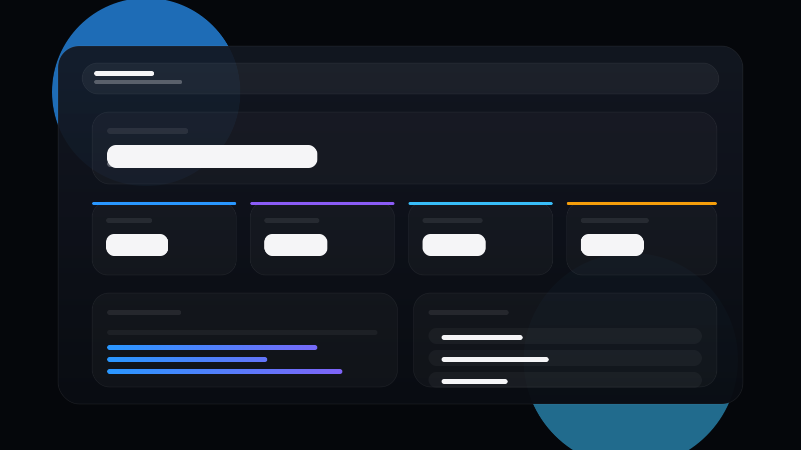

# theworker02 Portfolio


Production-ready developer portfolio for `theworker02`, built with React, Vite, Tailwind CSS, Framer Motion, a live GitHub project feed, a custom analytics backend, and a real contact email flow.

## Overview

This repo contains:

- A multi-page React frontend with animated routing and GitHub-powered project data
- An Express backend for analytics and contact form delivery
- A live dashboard for portfolio usage stats
- Build-time SEO helpers like `sitemap.xml` and `robots.txt`
- Deployment-ready frontend and backend configuration

## Preview




## Features

- Multi-page routed portfolio with polished transitions
- Dynamic GitHub repository ingestion and sorting
- Project detail pages with demo links and local setup instructions
- Contact form that posts to a real backend email endpoint
- Analytics tracking for page views, clicks, and demo launches
- Live dashboard backed by persisted analytics data
- Responsive layout for desktop, tablet, and mobile
- Vercel-ready SPA routing via `vercel.json`
- Production build hardening with minification and disabled source maps

## Tech Stack

- Frontend: React, Vite, React Router, Tailwind CSS, Framer Motion
- Backend: Express, Nodemailer, CORS, dotenv
- Persistence: `sql.js` with SQLite-style file storage for analytics
- External APIs: GitHub REST API
- Deployment targets: Vercel for frontend, Railway or Render for backend

## Routes

### Frontend routes

- `/`
- `/projects`
- `/projects/:projectId`
- `/demo/:projectId`
- `/docs`
- `/about`
- `/skills`
- `/github`
- `/dashboard`
- `/contact`
- `/404`

### Backend routes

- `GET /health`
- `POST /api/view`
- `POST /api/click`
- `GET /api/stats`
- `POST /api/contact`

## Environment Setup

Copy the example file:

'''bash
cp .env.example .env


### Important notes

- `EMAIL_PASS` must be a Gmail App Password, not your normal Gmail password.
- `VITE_ANALYTICS_API_URL` should point at the deployed backend in production.
- `FRONTEND_ORIGIN` should match your deployed frontend origin for CORS.

## Local Development

### 1. Install dependencies

```bash
npm install
```

### 2. Start the frontend

```bash
npm run dev
```

### 3. Start the backend in a second terminal

```bash
npm run dev:backend
```

### 4. Or run both together

```bash
npm run dev:full
```

## Available Scripts

- `npm run dev` - start the Vite frontend
- `npm run dev:frontend` - same as `npm run dev`
- `npm run dev:backend` - start the Express backend with file watching
- `npm run dev:full` - start frontend and backend together
- `npm run build` - regenerate SEO files and create the production frontend build
- `npm run preview` - preview the production frontend build
- `npm run start:backend` - run the backend in production mode
- `npm run verify:analytics` - run the backend analytics self-test

## Contact System

The contact form in the portfolio posts to `POST /api/contact`.

The backend:

- Validates `name`, `email`, and `message`
- Rejects invalid or empty submissions
- Applies simple in-memory rate limiting
- Sends emails through Gmail SMTP using Nodemailer
- Delivers messages to `matthewlooney5@gmail.com`

### Contact payload

```json
{
  "name": "Your Name",
  "email": "you@example.com",
  "message": "Your message here."
}
```

## Analytics System

The analytics backend stores usage events in a local SQLite-style database file and exposes summary data for the dashboard.

Tracked events:

- Page views
- Project clicks
- Demo launches

Returned dashboard data includes:

- Total site visits
- Total project interactions
- Demo counts
- Top pages
- Top projects
- Recent events

## Deployment

### Frontend on Vercel

1. Import the repo into Vercel.
2. Use `npm run build` as the build command.
3. Use `dist` as the output directory.
4. Keep `vercel.json` in place so route refreshes resolve to `index.html`.
5. Add these environment variables in Vercel:

```bash
VITE_GITHUB_HANDLE=theworker02
VITE_ANALYTICS_API_URL=https://your-backend-domain.example
VITE_SITE_URL=https://your-frontend-domain.example
```

### Backend on Railway or Render

1. Deploy the same repo as a Node service.
2. Use `npm install` as the install command.
3. Use `npm run start:backend` as the start command.


5. Attach persistent storage if you want analytics data to survive redeploys.

## Project Structure

```text
backend/
  server.js
config/
  site.ts
public/
  favicon.ico
  favicon.svg
  images/
scripts/
  dev-full.mjs
  generate-sitemap.mjs
  verify-analytics.mjs
server/
  app.js
  database.js
src/
  api/
  components/
  data/
  hooks/
  pages/
  styles/
```

## Current Status

This repo currently includes:

- GitHub-backed project catalog
- Sticky multi-page portfolio shell
- Working backend contact endpoint
- Working analytics pipeline
- Clean Vercel deployment setup

This repo does not currently include:

- A snapshot/version history UI
- A dedicated backend database server like Postgres
- Automated test coverage beyond the analytics verification script

## Verification

The project has been verified with:

```bash
npm run build
npm run verify:analytics
```

Contact endpoint verification status:

- Validation responses are working
- Email delivery requires valid `EMAIL_USER` and `EMAIL_PASS` environment variables

## Notes

- The frontend remains JavaScript-based by design; the repo was not force-migrated to full TypeScript.
- `backend/server.js` is a thin wrapper around `server/app.js` for compatibility and deployment flexibility.
- `sql.js` is used to keep analytics persistence lightweight and cross-platform.

## Documentation

- [Contributing Guide](CONTRIBUTING.md)
- [Changelog](CHANGELOG.md)
- [MIT License](LICENSE)
